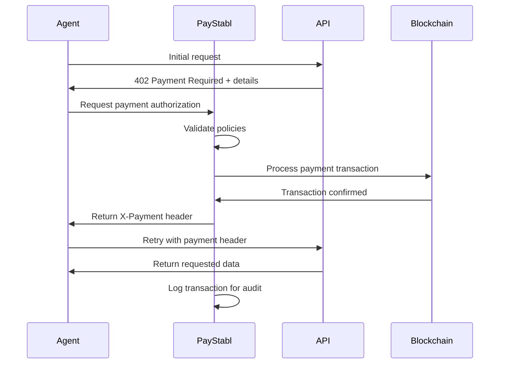
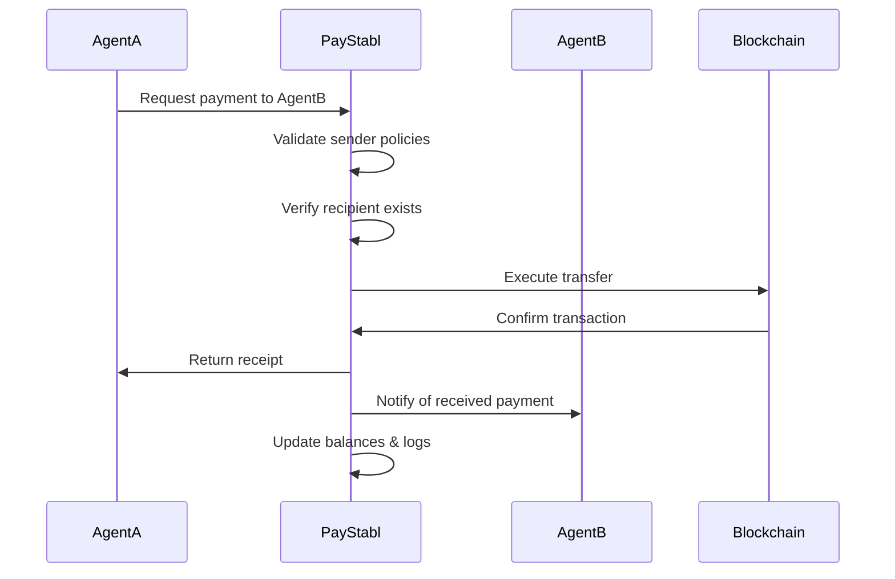

# System Architecture

PayStabl's architecture enables autonomous AI agents to handle payments through programmable smart wallets with policy governance and seamless M2M commerce capabilities.

## High-Level Architecture

```
┌─────────────────────────────────────────────────────────────────────┐
│                        PayStabl Ecosystem                          │
├─────────────────┬───────────────────┬───────────────────────────────┤
│   AI Agents     │  PayStabl Core    │    External Services          │
│                 │                   │                               │
│ ┌─────────────┐ │ ┌───────────────┐ │ ┌─────────────────────────────┐ │
│ │   Claude    │ │ │ Wallet Engine │ │ │      x402 APIs              │ │
│ │   MCP       │─┼─│               │─┼─│  • Weather Service          │ │
│ │   Server    │ │ │ Policy Engine │ │ │  • Research Databases       │ │
│ └─────────────┘ │ │               │ │ │  • Analysis Tools           │ │
│                 │ │ Session Mgmt  │ │ │  • Document Processing      │ │
│ ┌─────────────┐ │ │               │ │ └─────────────────────────────┘ │
│ │  LangGraph  │ │ │ Transaction   │ │                               │
│ │  Workflows  │─┼─│ Processing    │ │ ┌─────────────────────────────┐ │
│ │             │ │ │               │ │ │     Other AI Agents         │ │
│ └─────────────┘ │ └───────────────┘ │ │  • Specialist Agents        │ │
│                 │                   │ │  • Service Providers        │ │
│ ┌─────────────┐ │ ┌───────────────┐ │ │  • Tool Agents              │ │
│ │   n8n       │ │ │   Blockchain  │ │ │  • Data Processors          │ │
│ │ Workflows   │─┼─│   Layer       │ │ └─────────────────────────────┘ │
│ │             │ │ │  (Base L2)    │ │                               │
│ └─────────────┘ │ └───────────────┘ │ ┌─────────────────────────────┐ │
│                 │                   │ │    Coinbase Services        │ │
│ ┌─────────────┐ │ ┌───────────────┐ │ │  • CDP Platform             │ │
│ │   Custom    │ │ │   Monitoring  │ │ │  • Smart Wallets            │ │
│ │ Frameworks  │─┼─│   & Analytics │ │ │  • Gasless Transactions     │ │
│ │             │ │ │               │ │ │  • Multi-sig Support        │ │
│ └─────────────┘ │ └───────────────┘ │ └─────────────────────────────┘ │
└─────────────────┴───────────────────┴───────────────────────────────┘
```

## Core Components

### 1. Agent Wallet Engine

The heart of PayStabl's autonomous payment system:

```typescript
interface WalletEngine {
  // Core wallet operations
  createWallet(agentId: string): Promise<AgentWallet>;
  getWallet(agentId: string): Promise<AgentWallet>;
  
  // Payment processing
  processAPIPayment(request: APIPaymentRequest): Promise<PaymentResult>;
  processAgentPayment(request: AgentPaymentRequest): Promise<PaymentResult>;
  
  // Policy enforcement
  validateTransaction(transaction: Transaction): Promise<ValidationResult>;
  applyPolicies(agentId: string, transaction: Transaction): Promise<PolicyResult>;
}

interface AgentWallet {
  address: string;
  agentId: string;
  balance: Balance;
  policies: PolicySet;
  sessionLimits: SessionLimits;
  allowlist: string[];
}
```

**Key Features:**
- **Smart Contract Wallets**: Each agent gets a programmable wallet
- **Policy Governance**: Configurable spending limits and rules
- **Session Management**: Temporary permissions and allowances
- **Multi-signature Support**: For high-value or team operations

### 2. Policy Engine

Enforces spending rules and security controls:

```typescript
interface PolicyEngine {
  // Policy management
  setPolicies(agentId: string, policies: PolicySet): Promise<void>;
  getPolicies(agentId: string): Promise<PolicySet>;
  
  // Transaction validation
  validateSpendingLimit(agentId: string, amount: string): Promise<boolean>;
  validateAllowlist(agentId: string, recipient: string): Promise<boolean>;
  validateTimeRestrictions(agentId: string): Promise<boolean>;
  
  // Approval workflows
  requestApproval(transaction: Transaction): Promise<ApprovalRequest>;
  processApproval(requestId: string, decision: boolean): Promise<void>;
}

interface PolicySet {
  dailyLimit: string;
  perTransactionLimit: string;
  allowedDomains: string[];
  timeRestrictions: TimeRestriction[];
  approvalThreshold: string;
  multiSigRequired: boolean;
}
```

**Policy Types:**
- **Spending Limits**: Daily, weekly, per-transaction caps
- **Domain Allowlists**: Restrict payments to approved services
- **Time-based Controls**: Enable payments during specific hours
- **Approval Workflows**: Human oversight for large transactions
- **Multi-signature Requirements**: Team-based transaction approval

### 3. x402 Protocol Handler

Manages HTTP 402 "Payment Required" flows:

```typescript
interface X402Handler {
  // Protocol handling
  detectX402Response(response: HTTPResponse): boolean;
  parsePaymentRequest(response: HTTPResponse): PaymentRequest;
  
  // Payment processing
  generatePaymentHeader(request: PaymentRequest): Promise<string>;
  retryWithPayment(originalRequest: HTTPRequest, paymentHeader: string): Promise<HTTPResponse>;
  
  // Receipt management
  storeReceipt(payment: PaymentResult): Promise<void>;
  getReceipt(transactionId: string): Promise<PaymentReceipt>;
}

interface PaymentRequest {
  amount: string;
  currency: string;
  recipient: string;
  accepts: PaymentMethod[];
  challenge: string;
}
```

**Flow:**
1. Agent makes API request
2. Server responds with 402 + payment details
3. PayStabl processes payment automatically
4. Request retried with X-Payment header
5. Server returns requested data

### 4. Session Management

Handles temporary permissions and agent sessions:

```typescript
interface SessionManager {
  // Session lifecycle
  createSession(agentId: string, config: SessionConfig): Promise<Session>;
  getSession(sessionId: string): Promise<Session>;
  terminateSession(sessionId: string): Promise<void>;
  
  // Permission management
  grantTemporaryPermission(sessionId: string, permission: Permission): Promise<void>;
  revokePermission(sessionId: string, permission: Permission): Promise<void>;
  
  // Allowance management
  setSessionAllowance(sessionId: string, amount: string): Promise<void>;
  checkAllowanceRemaining(sessionId: string): Promise<string>;
}

interface Session {
  id: string;
  agentId: string;
  permissions: Permission[];
  allowance: string;
  allowanceUsed: string;
  expiresAt: Date;
  metadata: SessionMetadata;
}
```

**Session Features:**
- **Temporary Permissions**: Grant short-term access to services
- **Budget Allowances**: Set spending limits for specific tasks
- **Time-based Expiry**: Automatic session cleanup
- **Scope Limitation**: Restrict permissions to specific domains

## Data Flow

### API Payment Flow



### Agent-to-Agent Payment Flow



## Blockchain Integration

### Base Layer 2 Network

PayStabl operates on Base, Coinbase's Ethereum Layer 2:

**Benefits:**
- **Low Transaction Costs**: Minimal fees for agent transactions
- **Fast Confirmation**: Sub-second transaction finality
- **Ethereum Compatibility**: Full EVM support and tooling
- **Coinbase Integration**: Native support for CDP features

### Smart Contract Architecture

```solidity
// Core agent wallet contract
contract AgentWallet {
    address public agent;
    mapping(address => uint256) public dailyLimits;
    mapping(address => uint256) public dailySpent;
    mapping(address => bool) public allowlist;
    
    modifier onlyAgent() {
        require(msg.sender == agent, "Only agent can execute");
        _;
    }
    
    modifier withinLimits(uint256 amount) {
        require(
            dailySpent[msg.sender] + amount <= dailyLimits[msg.sender],
            "Daily limit exceeded"
        );
        _;
    }
    
    function executePayment(
        address recipient,
        uint256 amount,
        bytes calldata data
    ) external onlyAgent withinLimits(amount) {
        require(allowlist[recipient], "Recipient not allowed");
        
        dailySpent[msg.sender] += amount;
        
        // Execute payment
        (bool success,) = recipient.call{value: amount}(data);
        require(success, "Payment failed");
        
        emit PaymentExecuted(recipient, amount, data);
    }
}
```

### Gasless Transactions

PayStabl implements gasless transactions via Coinbase's paymaster:

```typescript
interface PaymasterService {
  // Gasless transaction support
  sponsorTransaction(transaction: Transaction): Promise<SponsoredTransaction>;
  estimateGasCost(transaction: Transaction): Promise<GasEstimate>;
  
  // Policy-based gas sponsorship
  shouldSponsorGas(agentId: string, transaction: Transaction): Promise<boolean>;
  getGasBudget(agentId: string): Promise<GasBudget>;
}
```

**Features:**
- **Zero Gas Fees**: Agents don't need ETH for transaction fees
- **Policy-based Sponsorship**: Control which transactions get sponsored
- **Cost Optimization**: Batch transactions for efficiency
- **Fail-safe Mechanisms**: Fallback to agent-paid gas if needed

## Security Model

### Multi-layered Security

```typescript
interface SecurityModel {
  // Identity verification
  verifyAgentIdentity(agentId: string, signature: string): Promise<boolean>;
  
  // Transaction security
  validateTransactionSignature(transaction: Transaction): Promise<boolean>;
  checkForSuspiciousActivity(agentId: string): Promise<SecurityAlert[]>;
  
  // Policy enforcement
  enforceSpendingLimits(agentId: string, amount: string): Promise<boolean>;
  requireMultiSigApproval(transaction: Transaction): Promise<boolean>;
  
  // Audit and compliance
  logSecurityEvent(event: SecurityEvent): Promise<void>;
  generateComplianceReport(agentId: string, period: TimePeriod): Promise<Report>;
}
```

**Security Features:**
- **Identity Verification**: Cryptographic agent authentication
- **Transaction Signing**: All transactions cryptographically signed
- **Spending Limits**: Automatic enforcement of payment policies
- **Suspicious Activity Detection**: ML-based fraud detection
- **Audit Trails**: Complete transaction logging
- **Multi-signature Support**: Team-based approval workflows

### Privacy and Compliance

```typescript
interface ComplianceEngine {
  // Privacy protection
  anonymizeTransactionData(transaction: Transaction): Transaction;
  handleDataDeletionRequest(agentId: string): Promise<void>;
  
  // Regulatory compliance
  performKYCCheck(agentId: string): Promise<KYCResult>;
  reportSuspiciousActivity(activity: SuspiciousActivity): Promise<void>;
  
  // Data retention
  setRetentionPolicy(policy: RetentionPolicy): Promise<void>;
  cleanupExpiredData(): Promise<CleanupResult>;
}
```

## Monitoring and Analytics

### Real-time Monitoring

```typescript
interface MonitoringSystem {
  // Performance metrics
  getTransactionThroughput(): Promise<ThroughputMetrics>;
  getSystemHealth(): Promise<HealthStatus>;
  
  // Financial metrics  
  getTotalVolumeProcessed(period: TimePeriod): Promise<VolumeMetrics>;
  getRevenueMetrics(period: TimePeriod): Promise<RevenueMetrics>;
  
  // Agent analytics
  getAgentActivityMetrics(agentId: string): Promise<ActivityMetrics>;
  getPopularServices(): Promise<ServiceMetrics[]>;
  
  // Alerts and notifications
  setAlertThreshold(metric: MetricType, threshold: number): Promise<void>;
  getActiveAlerts(): Promise<Alert[]>;
}
```

### Analytics Dashboard

Key metrics tracked:
- **Transaction Volume**: Daily/monthly payment volume
- **Success Rates**: Payment completion rates
- **Agent Activity**: Most active agents and services
- **Cost Analysis**: Gas costs and optimization opportunities
- **Security Events**: Failed attempts and policy violations
- **Revenue Metrics**: Platform fees and usage patterns

## Scalability and Performance

### Horizontal Scaling

```typescript
interface ScalingStrategy {
  // Load balancing
  distributeLoad(requests: Request[]): Promise<LoadDistribution>;
  addCapacity(region: string, instances: number): Promise<void>;
  
  // Database sharding
  shardByAgent(agentId: string): string;
  rebalanceShards(): Promise<RebalanceResult>;
  
  // Caching strategies
  cacheFrequentlyAccessedData(data: CacheableData): Promise<void>;
  invalidateCache(key: string): Promise<void>;
}
```

### Performance Optimizations

- **Database Sharding**: Agent data distributed across shards
- **Redis Caching**: Frequently accessed data cached
- **Connection Pooling**: Efficient database connections
- **Batch Processing**: Group similar transactions
- **CDN Integration**: Global content delivery
- **Async Processing**: Non-blocking payment processing

## Disaster Recovery

### Backup and Recovery

```typescript
interface DisasterRecovery {
  // Data backup
  createBackup(type: BackupType): Promise<BackupResult>;
  restoreFromBackup(backupId: string): Promise<RestoreResult>;
  
  // System recovery
  failoverToSecondary(): Promise<FailoverResult>;
  validateSystemIntegrity(): Promise<IntegrityReport>;
  
  // Agent wallet recovery
  recoverAgentWallet(agentId: string, recoveryKey: string): Promise<WalletRecovery>;
  exportWalletData(agentId: string): Promise<WalletExport>;
}
```

**Recovery Features:**
- **Automated Backups**: Regular snapshots of critical data
- **Multi-region Replication**: Data replicated across regions
- **Wallet Recovery**: Agent wallet restoration capabilities
- **Hot Failover**: Automatic failover to backup systems
- **Data Integrity Checks**: Continuous validation of data consistency

## Future Architecture Considerations

### Planned Enhancements

1. **Multi-chain Support**: Expand beyond Base to other L2s
2. **Advanced AI Integration**: ML-powered payment optimization
3. **Decentralized Governance**: DAO-based protocol governance
4. **Enhanced Privacy**: Zero-knowledge payment proofs
5. **Cross-chain Bridges**: Seamless asset movement
6. **Enterprise Features**: Advanced compliance and reporting

### Integration Roadmap

- **Q1 2024**: Enhanced MCP server features
- **Q2 2024**: LangGraph deep integration
- **Q3 2024**: Multi-chain wallet support
- **Q4 2024**: Advanced analytics and ML features

## Related Documentation

- [Security Guide](/docs/security) - Detailed security implementation
- [API Reference](/docs/reference/x402_headers) - Technical specifications
- [Integration Guides](/docs/integrations/mcp) - Framework integrations
- [Quickstart Guide](/docs/quickstart) - Getting started

## Support

- [Technical Documentation](https://docs.paystabl.com)
- [GitHub Repository](https://github.com/paystabl/core)
- [Discord Community](https://discord.gg/paystabl)
- [Email Support](mailto:support@paystabl.com)